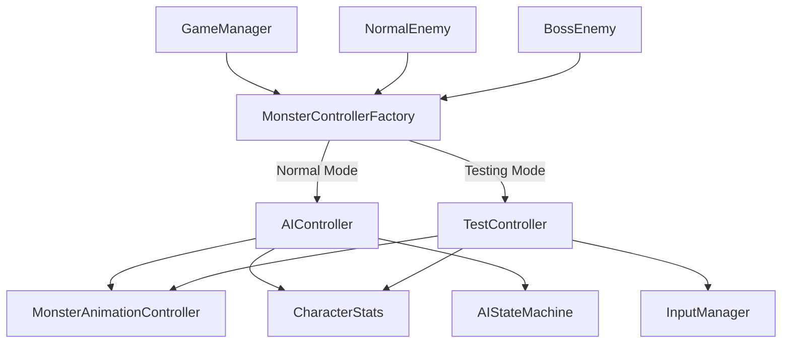

# Design Document

## Overview

本设计文档描述了怪物模式分离系统的技术架构。该系统将彻底分离怪物的AI控制逻辑和测试控制逻辑，通过控制器模式和工厂模式实现清晰的职责分离。系统支持多种怪物类型（NormalEnemy、Boss等），并在启动时根据游戏模式选择对应的控制策略。

## Architecture

### 核心架构原则

1. **控制器分离**: AI控制器和测试控制器完全独立，互不依赖
2. **接口统一**: 所有控制器实现相同的接口，确保一致性
3. **工厂创建**: 使用工厂模式根据游戏模式创建对应的控制器
4. **单一职责**: 每个控制器只负责一种控制逻辑
5. **启动时决定**: 游戏模式在启动时确定，运行时不切换

### 系统架构图



## Components and Interfaces

### 1. IMonsterController 接口

所有怪物控制器的基础接口，定义统一的控制方法：

```typescript
interface IMonsterController {
    // 初始化控制器
    initialize(enemyData: EnemyData): Promise<void>;
    
    // 更新控制器（每帧调用）
    update(deltaTime: number): void;
    
    // 移动控制
    move(direction: Vec2, deltaTime: number): void;
    stopMovement(): void;
    
    // 动作控制
    attack(): void;
    takeDamage(damage: number): void;
    
    // 状态查询
    isAlive(): boolean;
    getPosition(): Vec3;
    getStatusInfo(): string;
    
    // 生命周期
    destroy(): void;
}
```

### 2. MonsterControllerFactory 工厂类

负责根据游戏模式创建对应的控制器：

```typescript
class MonsterControllerFactory {
    static createController(
        gameMode: GameMode, 
        monsterNode: Node, 
        monsterType: MonsterType
    ): IMonsterController {
        switch (gameMode) {
            case GameMode.Normal:
                return new AIController(monsterNode, monsterType);
            case GameMode.Testing:
                return new TestController(monsterNode, monsterType);
            default:
                throw new Error(`Unsupported game mode: ${gameMode}`);
        }
    }
}
```

### 3. AIController 类

专门处理AI逻辑的控制器：

- 实现完整的AI状态机
- 处理怪物的自动行为（巡逻、追逐、攻击等）
- 不响应任何手动输入
- 与GameManager的AI更新系统集成

### 4. TestController 类

专门处理测试控制的控制器：

- 响应键盘输入进行手动控制
- 提供调试信息显示
- 不包含任何AI逻辑
- 与GameManager的输入系统集成

### 5. 重构后的怪物类

#### BaseMonster 抽象基类

```typescript
abstract class BaseMonster extends Component {
    protected controller: IMonsterController | null = null;
    protected characterStats: CharacterStats | null = null;
    protected animationController: MonsterAnimationController | null = null;
    
    // 抽象方法，由子类实现
    abstract getMonsterType(): MonsterType;
    
    // 通用初始化逻辑
    protected async initializeMonster(): Promise<void>;
    
    // 委托给控制器的方法
    public move(direction: Vec2, deltaTime: number): void;
    public handleInput(keyCode: KeyCode): void;
    // ... 其他方法
}
```

#### NormalEnemy 类

```typescript
class NormalEnemy extends BaseMonster {
    getMonsterType(): MonsterType {
        return MonsterType.NORMAL_ENEMY;
    }
}
```

#### BossEnemy 类

```typescript
class BossEnemy extends BaseMonster {
    getMonsterType(): MonsterType {
        return MonsterType.BOSS;
    }
}
```

## Data Models

### MonsterType 枚举

```typescript
enum MonsterType {
    NORMAL_ENEMY = 'normal_enemy',
    BOSS = 'boss',
    MINI_BOSS = 'mini_boss'
}
```

### ControllerConfig 接口

```typescript
interface ControllerConfig {
    monsterType: MonsterType;
    gameMode: GameMode;
    enemyData: EnemyData;
    enableDebug: boolean;
}
```

### AIState 枚举（仅AI控制器使用）

```typescript
enum AIState {
    IDLE = 'idle',
    PATROL = 'patrol',
    CHASE = 'chase',
    ATTACK = 'attack',
    RETURN = 'return',
    HURT = 'hurt',
    DEATH = 'death'
}
```

## Error Handling

### 控制器创建失败处理

1. **工厂创建失败**: 记录错误日志，返回默认的空控制器
2. **控制器初始化失败**: 尝试重新初始化，失败则禁用怪物
3. **运行时错误**: 捕获异常，记录日志，尝试恢复或安全停止

### 错误恢复策略

```typescript
class SafeControllerWrapper implements IMonsterController {
    private controller: IMonsterController;
    
    public update(deltaTime: number): void {
        try {
            this.controller.update(deltaTime);
        } catch (error) {
            console.error('Controller update failed:', error);
            this.handleControllerError(error);
        }
    }
    
    private handleControllerError(error: Error): void {
        // 错误恢复逻辑
    }
}
```

## Testing Strategy

### 单元测试

1. **控制器接口测试**: 验证所有控制器都正确实现接口
2. **工厂模式测试**: 验证工厂能够根据模式创建正确的控制器
3. **AI逻辑测试**: 测试AI状态机的各种状态转换
4. **输入处理测试**: 测试测试控制器的输入响应

### 集成测试

1. **模式切换测试**: 验证不同模式下怪物行为的正确性
2. **多怪物类型测试**: 验证不同类型怪物都能正常工作
3. **生命周期测试**: 验证怪物创建、运行、销毁的完整流程

### 测试用例示例

```typescript
describe('MonsterControllerFactory', () => {
    it('should create AIController in Normal mode', () => {
        const controller = MonsterControllerFactory.createController(
            GameMode.Normal, 
            mockNode, 
            MonsterType.NORMAL_ENEMY
        );
        expect(controller).toBeInstanceOf(AIController);
    });
    
    it('should create TestController in Testing mode', () => {
        const controller = MonsterControllerFactory.createController(
            GameMode.Testing, 
            mockNode, 
            MonsterType.NORMAL_ENEMY
        );
        expect(controller).toBeInstanceOf(TestController);
    });
});
```

## Implementation Notes

### 迁移策略

1. **第一阶段**: 创建接口和工厂类
2. **第二阶段**: 实现AI控制器，迁移现有AI逻辑
3. **第三阶段**: 实现测试控制器，迁移现有测试逻辑
4. **第四阶段**: 重构怪物类，使用新的控制器系统
5. **第五阶段**: 清理旧代码，添加Boss支持

### 性能考虑

1. **控制器缓存**: 避免频繁创建销毁控制器
2. **状态更新优化**: AI控制器使用时间片更新，避免每帧计算
3. **事件系统优化**: 减少不必要的事件监听和触发

### 扩展性设计

1. **新怪物类型**: 通过继承BaseMonster轻松添加
2. **新控制模式**: 通过实现IMonsterController接口添加
3. **AI行为扩展**: 通过修改AI状态机添加新行为
4. **测试功能扩展**: 通过扩展TestController添加新的测试命令