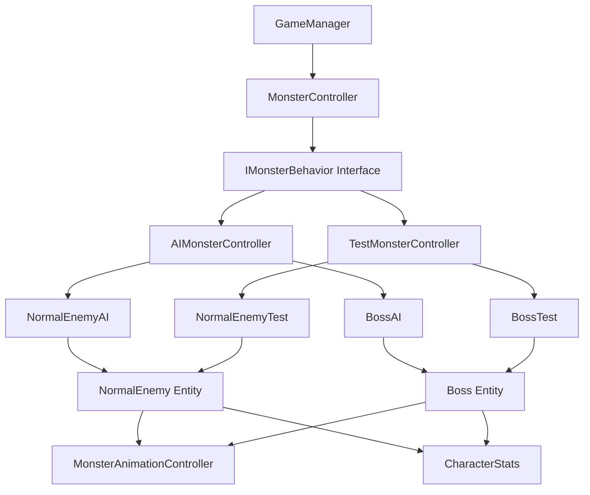

# Design Document

## Overview

本设计文档描述了如何将怪物系统的测试模式和正常模式逻辑完全分离。通过创建独立的控制器架构，确保AI控制和手动测试控制互不干扰，同时支持不同类型的怪物（NormalEnemy、Boss等）。

## Architecture

### 核心设计原则

1. **单一职责原则**: 每个控制器只负责一种控制模式
2. **接口隔离**: 通过统一接口支持不同怪物类型
3. **模式独立**: 测试模式和正常模式完全独立，不支持运行时切换
4. **可扩展性**: 支持未来添加新的怪物类型和控制模式

### 系统架构图



## Components and Interfaces

### 1. IMonsterBehavior 接口

定义所有怪物控制器必须实现的基本接口：

```typescript
interface IMonsterBehavior {
    // 生命周期
    initialize(enemyData: EnemyData): Promise<void>;
    activate(): void;
    deactivate(): void;
    destroy(): void;
    
    // 控制方法
    update(deltaTime: number): void;
    handleInput?(keyCode: KeyCode): void;
    
    // 状态查询
    isActive(): boolean;
    getControllerType(): MonsterControllerType;
    getStatusInfo(): string;
}
```

### 2. MonsterController 主控制器

负责管理怪物的控制器生命周期和模式选择：

```typescript
class MonsterController extends Component {
    private currentBehavior: IMonsterBehavior | null = null;
    private enemyData: EnemyData | null = null;
    private controllerType: MonsterControllerType;
    
    // 根据游戏模式初始化对应的控制器
    public async initializeWithMode(gameMode: GameMode, enemyData: EnemyData): Promise<void>;
    
    // 更新当前激活的控制器
    public update(deltaTime: number): void;
    
    // 处理输入（仅测试模式）
    public handleInput(keyCode: KeyCode): void;
}
```

### 3. AIMonsterController AI控制器

专门处理AI逻辑的控制器：

```typescript
class AIMonsterController implements IMonsterBehavior {
    private aiStateMachine: MonsterAIStateMachine;
    private enemyType: EnemyType;
    
    // AI状态机更新
    public update(deltaTime: number): void;
    
    // AI行为逻辑
    private executeAIBehavior(deltaTime: number): void;
}
```

### 4. TestMonsterController 测试控制器

专门处理手动测试控制的控制器：

```typescript
class TestMonsterController implements IMonsterBehavior {
    private inputHandler: TestInputHandler;
    private movementController: TestMovementController;
    
    // 处理测试输入
    public handleInput(keyCode: KeyCode): void;
    
    // 测试模式更新
    public update(deltaTime: number): void;
}
```

### 5. 怪物实体类重构

#### BaseMonster 基类

```typescript
abstract class BaseMonster extends Component {
    protected characterStats: CharacterStats | null = null;
    protected animationController: MonsterAnimationController | null = null;
    protected monsterController: MonsterController | null = null;
    
    // 通用初始化逻辑
    protected abstract setupMonsterSpecifics(): void;
    
    // 获取怪物类型
    public abstract getMonsterType(): EnemyType;
}
```

#### NormalEnemy 重构

```typescript
class NormalEnemy extends BaseMonster {
    // 移除所有AI和测试逻辑
    // 只保留基本的怪物属性和组件管理
    
    protected setupMonsterSpecifics(): void {
        // NormalEnemy特有的设置
    }
    
    public getMonsterType(): EnemyType {
        return EnemyType.NORMAL_ENEMY;
    }
}
```

#### Boss 类

```typescript
class Boss extends BaseMonster {
    // Boss特有的属性和行为
    
    protected setupMonsterSpecifics(): void {
        // Boss特有的设置
    }
    
    public getMonsterType(): EnemyType {
        return EnemyType.BOSS;
    }
}
```

## Data Models

### 枚举定义

```typescript
enum MonsterControllerType {
    AI_CONTROLLER = 'ai',
    TEST_CONTROLLER = 'test'
}

enum EnemyType {
    NORMAL_ENEMY = 'normal_enemy',
    BOSS = 'boss'
}
```

### 配置接口

```typescript
interface MonsterControllerConfig {
    controllerType: MonsterControllerType;
    enemyType: EnemyType;
    enableDebugMode: boolean;
}

interface AIBehaviorConfig {
    stateMachineType: string;
    aggressionLevel: number;
    patrolRadius: number;
    chaseDistance: number;
}

interface TestControllerConfig {
    enableAllInputs: boolean;
    debugDisplayLevel: number;
    allowedCommands: string[];
}
```

## Error Handling

### 错误类型定义

```typescript
enum MonsterControllerError {
    CONTROLLER_INIT_FAILED = 'CONTROLLER_INIT_FAILED',
    INVALID_GAME_MODE = 'INVALID_GAME_MODE',
    BEHAVIOR_NOT_FOUND = 'BEHAVIOR_NOT_FOUND',
    ENEMY_DATA_MISSING = 'ENEMY_DATA_MISSING'
}
```

### 错误处理策略

1. **初始化失败**: 回退到默认AI控制器
2. **控制器切换失败**: 保持当前控制器状态
3. **数据缺失**: 使用默认配置并记录警告
4. **运行时错误**: 停用当前控制器并通知GameManager

## Testing Strategy

### 单元测试

1. **IMonsterBehavior接口测试**
   - 测试所有实现类是否正确实现接口
   - 测试生命周期方法的调用顺序

2. **AIMonsterController测试**
   - 测试AI状态机转换
   - 测试不同怪物类型的AI行为

3. **TestMonsterController测试**
   - 测试输入处理逻辑
   - 测试手动控制功能

### 集成测试

1. **模式独立性测试**
   - 验证AI模式下不响应手动输入
   - 验证测试模式下AI逻辑完全停用

2. **怪物类型支持测试**
   - 测试NormalEnemy在两种模式下的行为
   - 测试Boss在两种模式下的行为

3. **生命周期测试**
   - 测试控制器的创建、激活、停用、销毁流程

### 性能测试

1. **大量怪物测试**: 测试同时存在多个怪物时的性能表现
2. **模式切换测试**: 测试游戏启动时模式选择的性能影响
3. **内存泄漏测试**: 确保控制器正确清理资源

## Implementation Notes

### 关键实现要点

1. **GameManager集成**
   - 在GameManager初始化时确定游戏模式
   - 移除运行时模式切换逻辑
   - 简化输入分发逻辑

2. **MonsterSpawner适配**
   - 修改怪物创建逻辑，根据游戏模式初始化对应控制器
   - 支持不同怪物类型的创建

3. **事件系统优化**
   - 减少不必要的事件监听
   - 优化控制器间的通信

4. **向后兼容性**
   - 保持现有API的兼容性
   - 提供迁移指南

### 文件结构

```
assets/scripts/
├── monster/
│   ├── controllers/
│   │   ├── IMonsterBehavior.ts
│   │   ├── MonsterController.ts
│   │   ├── AIMonsterController.ts
│   │   └── TestMonsterController.ts
│   ├── entities/
│   │   ├── BaseMonster.ts
│   │   ├── NormalEnemy.ts
│   │   └── Boss.ts
│   └── behaviors/
│       ├── ai/
│       │   ├── NormalEnemyAI.ts
│       │   └── BossAI.ts
│       └── test/
│           ├── NormalEnemyTest.ts
│           └── BossTest.ts
```

这个设计确保了：
- 测试模式和正常模式完全独立
- 支持不同类型的怪物
- 代码结构清晰，易于维护和扩展
- 性能优化，避免不必要的逻辑执行