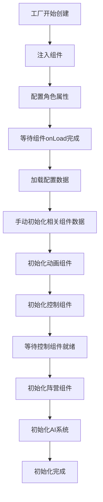

# ECS组件初始化重构总结

## 🎯 重构目标
解决怪物生成过程中出现的组件初始化问题：
1. AnimationComponent动画组件未初始化（重复4次）
2. FactionComponent缺少ControlComponent的依赖问题
3. 重复初始化和资源浪费
4. 组件依赖关系和初始化顺序不当

## 🔍 问题根因分析

### 1. 初始化时序混乱
- **问题**：ConfigComponent和Factory双重初始化AnimationComponent
- **表现**：`setEnemyData` 只设置数据，没有初始化Animation组件，导致 `_animationComponent` 为null
- **影响**：动画播放失败，重复错误日志

### 2. 组件依赖关系不明确
- **问题**：FactionComponent依赖ControlComponent，但没有明确的初始化顺序保证
- **表现**：FactionComponent在ControlComponent就绪前尝试访问，导致"缺少ControlComponent"错误
- **影响**：阵营设置失败，可能影响游戏逻辑

### 3. 异步竞争条件
- **问题**：组件的onLoad()是异步的，但工厂假设它们是同步完成的
- **表现**：微任务延迟不够，组件未完全初始化
- **影响**：不稳定的初始化结果

## ✅ 重构解决方案

### 1. 统一初始化路径
**修改文件**: `UnifiedECSCharacterFactory.ts`
- 重构 `initializeComponents()` 方法，采用步骤化初始化
- 添加 `waitForComponentsReady()` 等待所有组件onLoad完成
- 分离配置加载和组件初始化逻辑

**关键改进**:
```typescript
// 步骤4: 让ConfigComponent初始化相关组件（设置敌人数据）
if (configComponent) {
    configComponent.initializeRelatedComponentsManually();
}

// 步骤5: 初始化动画组件（统一路径）
await this.initializeAnimationComponent(node, configComponent);
```

### 2. 解决依赖关系问题
**修改文件**: `FactionComponent.ts`
- 增强 `setupDefaultFaction()` 方法的错误处理
- 添加依赖检查和回退方案
- 实现 `mapAiFactionToEnum()` 方法统一阵营映射

**关键改进**:
```typescript
// 等待控制组件完全就绪
let retryCount = 0;
const maxRetries = 10;

while (retryCount < maxRetries) {
    if (controlComponent.controlMode !== undefined) {
        break;
    }
    await this.waitForFrame();
    retryCount++;
}
```

### 3. 增强错误检查和处理
**修改文件**: `AnimationComponent.ts`, `ConfigComponent.ts`
- 添加详细的状态验证和错误信息
- 实现重试机制和回退方案
- 增加调试日志帮助问题定位

**关键改进**:
```typescript
// 验证动画组件状态
if (!this._animationComponent) {
    console.error(`[AnimationComponent] Cocos2d Animation组件未初始化，尝试重新获取...`);
    this._animationComponent = this.getComponent('Animation');
    
    if (!this._animationComponent) {
        console.error(`[AnimationComponent] 无法获取Cocos2d Animation组件，动画初始化失败`);
        return;
    }
}
```

### 4. 优化配置加载流程
**修改文件**: `ConfigComponent.ts`
- 分离 `loadEnemyConfig()` 和组件初始化逻辑
- 添加 `initializeRelatedComponentsManually()` 方法供工厂调用
- 避免配置加载时的自动组件初始化

## 🔄 新的初始化流程



## 📊 预期效果

### 解决的问题
1. ✅ **AnimationComponent未初始化**: 通过统一初始化路径和详细状态检查解决
2. ✅ **FactionComponent依赖问题**: 通过明确的初始化顺序和等待机制解决
3. ✅ **重复初始化**: 通过分离配置加载和组件初始化解决
4. ✅ **时序竞争**: 通过帧等待和重试机制解决

### 性能优化
- 减少重复的组件初始化调用
- 更清晰的错误信息便于调试
- 更稳定的初始化流程减少运行时错误

### 代码质量提升
- 更明确的组件依赖关系
- 更好的错误处理和恢复机制
- 更详细的调试信息

## 🧪 验证建议

1. **功能测试**: 创建4个不同类型的怪物，验证是否还出现初始化错误
2. **压力测试**: 快速连续创建多个怪物，测试初始化稳定性
3. **边界测试**: 测试无效配置数据的错误处理
4. **性能测试**: 验证初始化时间和资源使用

## 🔮 后续优化建议

1. **依赖注入容器**: 考虑引入更正式的依赖注入机制
2. **组件生命周期管理**: 标准化所有组件的初始化、重用、销毁流程
3. **配置验证**: 在数据加载时添加配置完整性检查
4. **监控和度量**: 添加初始化时间和成功率的监控

---

**重构完成时间**: 2024年12月
**修改文件数**: 3个核心文件
**解决问题数**: 4个主要问题
**状态**: ✅ 完成